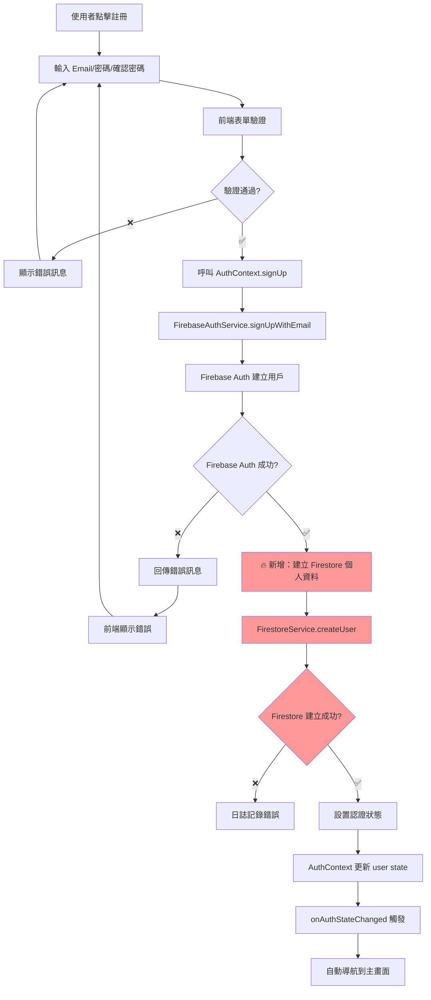
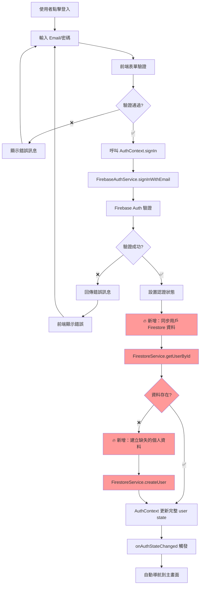
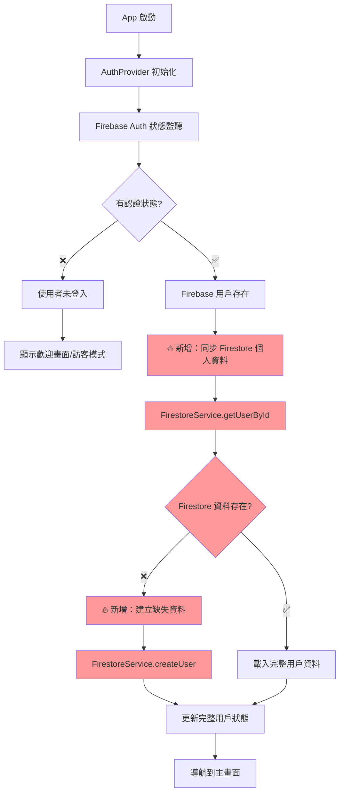

# 🔐 完整用戶註冊與登入流程分析

## 目前實作狀況總覽

### ✅ 已實作的部分

1. **Firebase Auth 服務** - `FirebaseAuthService.ts`
2. **AuthContext** - 全域認證狀態管理
3. **UI 畫面** - 註冊和登入畫面
4. **基本驗證** - Email、密碼格式驗證
5. **FirestoreService** - 有用戶個人資料建立功能
6. **日誌系統** - 完整的認證事件記錄

### ❌ 缺少的關鍵部分

1. **註冊後自動建立用戶個人資料到 Firestore**
2. **Email 驗證流程**
3. **密碼重設功能**
4. **Google 登入完整實作**
5. **登入後用戶資料同步**
6. **錯誤處理的中文化**

## 詳細流程圖

### 📝 註冊流程圖

### 🔑 登入流程圖

### 🔄 認證狀態監控流程

## 🔧 需要修復的關鍵問題

### 1. 註冊後缺少 Firestore 個人資料建立

**問題**：目前註冊只建立 Firebase Auth 用戶，沒有在 Firestore 建立對應的個人資料。

**影響**：

- 用戶個人資料為空
- 無法儲存偏好設置
- 統計數據無法記錄

**解決方案**：在 `AuthContext.signUp` 中加入 Firestore 資料建立邏輯

### 2. 登入後缺少用戶資料同步

**問題**：登入成功後只有基本的 Firebase Auth 資訊，沒有完整的個人資料。

**影響**：

- 用戶偏好無法載入
- 個人化功能無法正常運作
- 統計數據顯示不正確

**解決方案**：在認證成功後自動同步 Firestore 個人資料

### 3. 錯誤訊息未中文化

**問題**：Firebase 錯誤訊息是英文，用戶體驗不佳。

**解決方案**：在 `FirebaseAuthService.handleAuthError` 中加入中文錯誤訊息對應

## 🚀 實作優先順序

1. **高優先級**：註冊後自動建立 Firestore 個人資料
2. **高優先級**：登入後同步用戶完整資料
3. **中優先級**：錯誤訊息中文化
4. **低優先級**：Email 驗證流程
5. **低優先級**：密碼重設功能

## 📋 技術實作檢查清單

### 註冊流程修復

- [ ] 修改 `AuthContext.signUp` 方法
- [ ] 整合 `FirestoreService.createUser`
- [ ] 加入錯誤處理和回滾邏輯
- [ ] 撰寫對應的測試案例

### 登入流程修復

- [ ] 修改 `AuthContext.signIn` 方法
- [ ] 加入 Firestore 資料同步邏輯
- [ ] 處理資料缺失的情況
- [ ] 撰寫對應的測試案例

### 錯誤處理改善

- [ ] 建立中文錯誤訊息對應表
- [ ] 修改 `handleAuthError` 方法
- [ ] 測試各種錯誤情況的顯示

### 測試覆蓋

- [ ] 註冊流程整合測試
- [ ] 登入流程整合測試
- [ ] 錯誤情況測試
- [ ] 認證狀態變化測試
