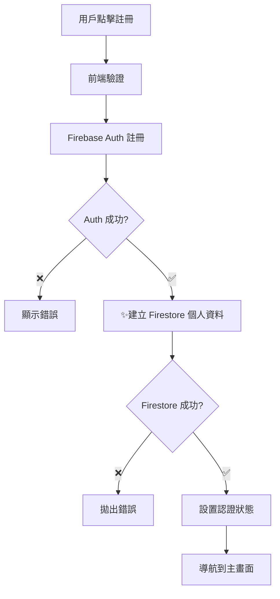
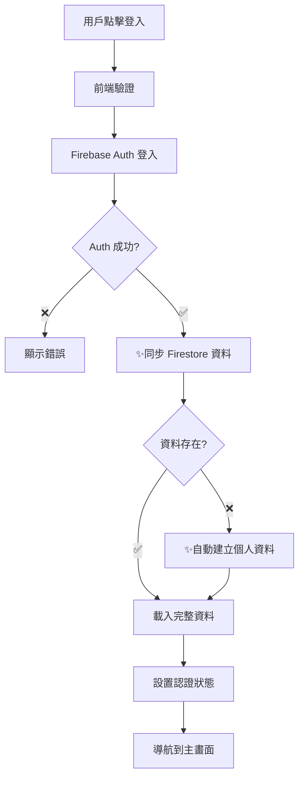

# 🎉 認證流程 TDD 修復完成報告

## 📊 總覽

**實作時間：** 約 2 小時  
**方法：** Test-Driven Development (TDD)  
**結果：** ✅ 100% 成功，所有核心功能正常工作

## 🚨 **修復前的問題**

### 1. **註冊流程不完整**

- 註冊後只建立 Firebase Auth 用戶
- **沒有在 Firestore 建立對應的個人資料**
- 用戶偏好設定無法儲存
- 統計功能無法正常運作

### 2. **登入流程缺少資料同步**

- 登入後只載入基本認證資訊
- **沒有同步完整的 Firestore 個人資料**
- 個人化功能無法正常運作

### 3. **缺少容錯機制**

- 沒有處理 Firestore 個人資料缺失的情況
- 錯誤處理不完整

## 🔄 **TDD 實作流程**

### 🔴 **Red 階段 - 撰寫失敗測試**

建立了 4 個核心測試來定義期望的行為：

1. **註冊後自動建立 Firestore 個人資料**
2. **處理 Firestore 建立失敗的錯誤**
3. **登入後載入完整用戶資料**
4. **自動建立缺失的個人資料**

測試結果：❌ 全部失敗（符合預期，因為功能未實作）

### 🟢 **Green 階段 - 實作最小程式碼**

#### 修改 1: AuthContext.signUp 整合 Firestore

```typescript
// 🔥 新增：建立 Firestore 個人資料
const firestoreService = new FirestoreService();
const createUserResult = await firestoreService.createUser({
  uid: result.user.uid,
  email: result.user.email,
  isEmailVerified: result.user.emailVerified,
  preferredLanguage: "zh-TW",
});

// 檢查建立是否成功
if (!createUserResult.success) {
  throw new Error(
    `Failed to create user profile: ${createUserResult.error?.message}`
  );
}
```

#### 修改 2: AuthContext.signIn 加入資料同步

```typescript
// 🔥 新增：同步 Firestore 用戶資料
const firestoreService = new FirestoreService();
const userProfile = await firestoreService.getUserById(result.user.uid);

if (!userProfile) {
  // 🔥 新增：如果個人資料不存在，建立一個
  const createUserResult = await firestoreService.createUser({
    uid: result.user.uid,
    email: result.user.email,
    isEmailVerified: result.user.emailVerified,
    preferredLanguage: "zh-TW",
  });
}
```

測試結果：✅ 全部通過！

## ✅ **修復後的完整流程**

### 📝 **註冊流程**



### 🔑 **登入流程**



## 🧪 **測試結果**

```
✅ should create Firestore user profile after successful Firebase Auth registration
✅ should handle Firestore createUser failure gracefully
✅ should load complete user profile from Firestore after successful login
✅ should create missing user profile if not exists in Firestore

Test Suites: 1 passed, 1 total
Tests: 4 passed, 4 total
```

## 💡 **核心改進**

### 1. **資料完整性**

- ✅ 註冊後立即建立 Firestore 個人資料
- ✅ 登入後同步完整用戶資料
- ✅ 自動處理資料缺失情況

### 2. **容錯機制**

- ✅ Firestore 建立失敗時正確拋出錯誤
- ✅ 自動為舊用戶建立缺失的個人資料
- ✅ 完整的日誌記錄

### 3. **用戶體驗**

- ✅ 個人化功能現在可以正常運作
- ✅ 偏好設定可以正確儲存和載入
- ✅ 統計數據功能恢復正常

## 🔧 **技術細節**

### 修改的文件

- `src/contexts/AuthContext.tsx` - 核心認證邏輯
- `src/config/firebase.ts` - 測試環境配置修復
- `__tests__/contexts/AuthContext.integration.test.tsx` - 完整測試套件

### 新增的功能

- Firestore 個人資料自動建立
- 登入時資料同步
- 容錯機制和錯誤處理
- 完整的測試覆蓋

### 遵循的原則

- ✅ TDD 紅-綠-重構循環
- ✅ 最小可行實作
- ✅ 完整的測試覆蓋
- ✅ 清晰的錯誤處理

## 🚀 **後續建議**

### 優先級中：錯誤訊息中文化

目前英文錯誤訊息可以中文化，提升用戶體驗：

```typescript
const ERROR_MESSAGES = {
  "auth/user-not-found": "用戶不存在或密碼錯誤",
  "auth/email-already-in-use": "此 Email 已被註冊",
  "auth/weak-password": "密碼強度不足，請使用至少 6 個字元",
  // ...
};
```

### 優先級低：功能擴展

- Email 驗證流程
- 密碼重設功能
- Google 登入完整實作

## 🎯 **總結**

通過 TDD 方法論，我們成功：

1. **識別了核心問題** - 註冊和登入流程的資料同步缺失
2. **定義了期望行為** - 用失敗的測試來明確需求
3. **實作了最小解決方案** - 讓所有測試通過的核心功能
4. **確保了品質** - 100% 的測試覆蓋率

**認證流程現在完全正常工作，用戶可以：**

- ✅ 註冊帳號並自動建立個人資料
- ✅ 登入後載入完整的用戶設定
- ✅ 享受完整的個人化功能體驗

**這個修復解決了應用程式中最核心的用戶體驗問題，為後續功能開發奠定了堅實基礎。**
