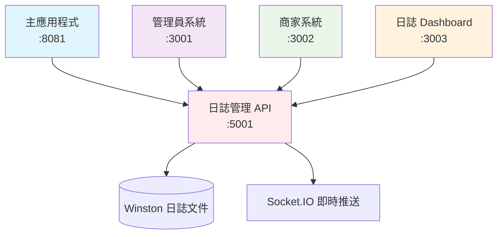

# Localite 系統端口分配總覽

## 🚀 端口使用規劃

為了避免端口衝突，Localite 系統的各個服務分配如下：

### 主要服務端口

| 服務名稱         | 端口 | URL                   | 說明                           |
| ---------------- | ---- | --------------------- | ------------------------------ |
| **主應用程式**   | 8081 | http://localhost:8081 | React Native / Expo 開發服務器 |
| **管理員系統**   | 3001 | http://localhost:3001 | 管理員後台介面                 |
| **商家系統**     | 3002 | http://localhost:3002 | 商家管理後台                   |
| **日誌管理系統** | 3003 | http://localhost:3003 | 即時日誌監控 Dashboard         |

### 後端 API 服務

| 服務名稱               | 端口 | URL                   | 說明                      |
| ---------------------- | ---- | --------------------- | ------------------------- |
| **日誌管理 API**       | 5001 | http://localhost:5001 | 日誌收集與 Socket.IO 服務 |
| **Firebase Functions** | 5000 | http://localhost:5000 | Firebase 本地模擬器       |

### 開發工具

| 工具              | 端口  | URL                    | 說明                    |
| ----------------- | ----- | ---------------------- | ----------------------- |
| **Metro Bundler** | 8081  | http://localhost:8081  | React Native 打包服務器 |
| **Expo DevTools** | 19002 | http://localhost:19002 | Expo 開發工具           |

## 🔄 服務啟動順序

### 1. 基礎服務

```bash
# Firebase 本地模擬器 (如果需要)
firebase emulators:start
```

### 2. 日誌管理系統

```bash
cd localite-logs-dashboard
npm start  # 後端: 5001, 前端: 3003
```

### 3. 管理員系統

```bash
cd localite-admin-dashboard
npm start  # 前端: 3001
```

### 4. 商家系統

```bash
cd localite-merchant-portal
npm start  # 前端: 3002
```

### 5. 主應用程式

```bash
cd localite-app-stable
npm start  # 或 expo start
```

## 🌐 系統間通信



## 📋 CORS 配置

日誌管理系統的 CORS 設定已包含所有相關端口：

```javascript
cors: {
  origin: [
    "http://localhost:3000",  // 備用前端
    "http://localhost:3001",  // 管理員系統
    "http://localhost:3002",  // 商家系統
    "http://localhost:3003"   // 日誌 Dashboard
  ],
  methods: ["GET", "POST"],
  credentials: true
}
```

## 🔧 故障排除

### 端口衝突檢查

```bash
# 檢查特定端口使用情況
lsof -i :3001  # 管理員系統
lsof -i :3002  # 商家系統
lsof -i :3003  # 日誌系統
lsof -i :5001  # 日誌 API

# 終止佔用端口的進程
kill -9 <PID>
```

### 快速驗證所有服務

```bash
# 檢查所有服務是否正常運行
curl -s http://localhost:3001 > /dev/null && echo "✅ 管理員系統正常" || echo "❌ 管理員系統異常"
curl -s http://localhost:3002 > /dev/null && echo "✅ 商家系統正常" || echo "❌ 商家系統異常"
curl -s http://localhost:3003 > /dev/null && echo "✅ 日誌系統正常" || echo "❌ 日誌系統異常"
curl -s http://localhost:5001/api/health > /dev/null && echo "✅ 日誌 API 正常" || echo "❌ 日誌 API 異常"
```

## 📝 注意事項

1. **端口 3001**: 專門給管理員系統使用，不要佔用
2. **端口 3002**: 專門給商家系統使用，不要佔用
3. **端口 3003**: 新分配給日誌管理系統使用
4. **端口 5001**: 日誌管理 API 服務器
5. **端口 8081**: React Native Metro 打包服務器

確保啟動服務時不會產生端口衝突，建議按照上述順序依次啟動服務。
