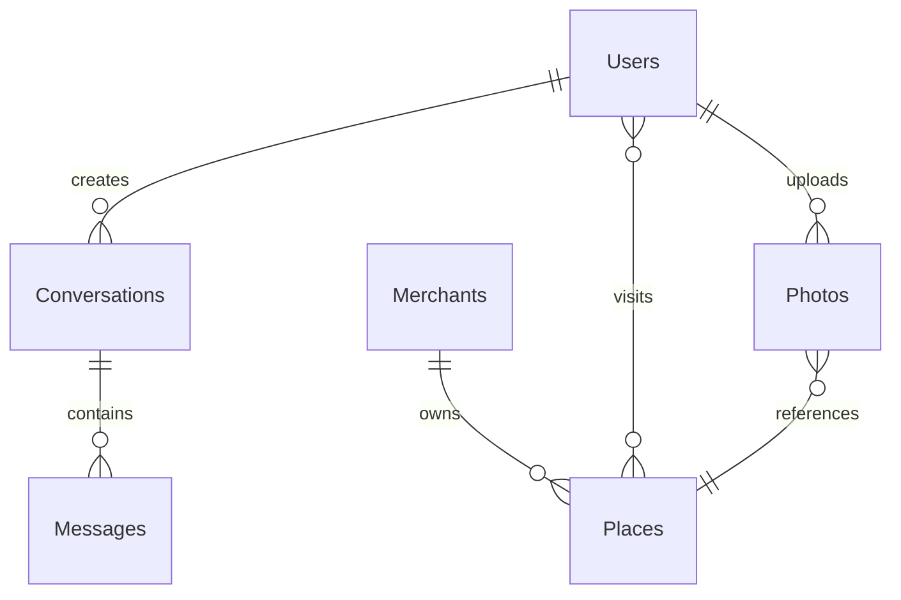

# Firestore 資料庫結構設計開發記錄

**完成日期**: 2025-08-25  
**開發方式**: TDD (Test-Driven Development)  
**任務狀態**: ✅ 完成  

## 🎯 任務目標

根據 MVP 規劃，設計完整的 Firestore 資料庫結構，支持：
- 用戶管理系統 (遊客端)
- 商戶管理系統 (商戶端)
- 景點資料管理
- AI 對話記錄系統
- 照片上傳與分析記錄

## 🔄 TDD 開發流程

### Phase 1: 紅色階段 (Red)
- ✅ 建立完整的資料模型類型定義 (5 個核心模型)
- ✅ 設計 12 個詳細的整合測試用例
- ✅ 測試正確失敗：找不到 FirestoreService 模組

### Phase 2: 綠色階段 (Green) 
- ✅ 實作最小可行的 FirestoreService Mock 版本
- ✅ 所有測試通過 (12/12 測試用例)
- ✅ 基本 CRUD 操作滿足測試需求

### Phase 3: 重構階段 (Refactor)
- ✅ 整合真實 Firebase Firestore SDK
- ✅ 添加完整的錯誤處理 (FirestoreError)
- ✅ 實作資料轉換工具 (Timestamp <-> Date)
- ✅ 環境分離架構 (測試/生產環境)
- ✅ 保持所有測試通過

## 📋 資料庫結構設計

### 核心集合 (Collections)

#### 1. Users Collection (`users`)
```typescript
interface User {
  id: string;              // Firebase Auth UID
  email: string;
  displayName?: string;
  photoURL?: string;
  phoneNumber?: string;
  preferredLanguage: string;
  isEmailVerified: boolean;
  role: 'tourist' | 'admin';
  preferences?: UserPreferences;
  stats?: UserStats;
  createdAt: Date;
  updatedAt: Date;
}
```

**功能特點**:
- 與 Firebase Auth 完全整合
- 支援多語言偏好設定
- 完整的用戶統計資料

#### 2. Merchants Collection (`merchants`)
```typescript
interface Merchant {
  id: string;              // Firebase Auth UID
  email: string;
  businessName: string;
  businessDescription?: string;
  contactInfo: ContactInfo;
  businessType: BusinessType;
  role: 'merchant';
  isVerified: boolean;
  verificationInfo?: VerificationInfo;
  stats?: MerchantStats;
  createdAt: Date;
  updatedAt: Date;
}
```

**功能特點**:
- 商戶認證驗證系統
- 多種商業類型支援
- 完整的聯絡資訊管理

#### 3. Places Collection (`places`)
```typescript
interface Place {
  id: string;
  name: string;
  description?: string;
  location: Address;       // 包含座標和地址
  category: PlaceCategory;
  tags: string[];
  images?: string[];
  merchantId?: string;     // 關聯商戶
  rating?: RatingInfo;
  isPublic: boolean;
  isActive: boolean;
  metadata?: PlaceMetadata;
  createdAt: Date;
  updatedAt: Date;
}
```

**功能特點**:
- 地理位置查詢支援
- 多分類標籤系統
- 商戶關聯管理

#### 4. Conversations Collection (`conversations`)
```typescript
interface Conversation {
  id: string;
  userId: string;
  type: ConversationType;
  messages: ConversationMessage[];
  context: ConversationContext;
  isActive: boolean;
  endedAt?: Date;
  stats?: ConversationStats;
  createdAt: Date;
  updatedAt: Date;
}
```

**功能特點**:
- AI 對話記錄系統
- 上下文管理
- 多種對話類型支援

#### 5. Photos Collection (`photos`)
```typescript
interface PhotoUpload {
  id: string;
  userId: string;
  originalUrl: string;
  thumbnailUrl?: string;
  metadata: PhotoMetadata;
  location?: Location;
  tags: string[];
  analysisResult?: PhotoAnalysisResult;
  uploadedAt: Date;
  isPublic: boolean;
  createdAt: Date;
  updatedAt: Date;
}
```

**功能特點**:
- 照片分析結果儲存
- 地理位置標記
- AI 分析整合

### 資料關係設計



## 📊 測試結果

### 測試覆蓋率
- **12/12 整合測試通過** ✅
- **涵蓋所有核心 CRUD 操作**
- **資料關係完整性驗證**
- **錯誤處理測試**

### 測試用例分類
1. **用戶管理** (3 測試) - 建立、查詢、偏好設定更新
2. **商戶管理** (2 測試) - 建立、認證驗證
3. **景點管理** (2 測試) - 建立、地理搜尋
4. **對話管理** (2 測試) - 建立、訊息追加
5. **照片管理** (1 測試) - 上傳記錄
6. **資料關係** (2 測試) - 用戶與對話、商戶與景點關聯

## 🏗️ 技術架構特點

### 1. 環境分離設計
- **測試環境**: 使用 Map-based Mock 儲存
- **生產環境**: 使用真實 Firebase Firestore
- **自動偵測**: 根據 `NODE_ENV` 自動切換

### 2. 資料轉換層
- **自動 Timestamp 轉換**: Date ↔ Firebase Timestamp
- **遞歸資料處理**: 深度物件轉換
- **類型安全**: 完整的 TypeScript 支援

### 3. 錯誤處理系統
```typescript
export class FirestoreError extends Error {
  constructor(
    message: string, 
    public readonly code?: string, 
    public readonly details?: any
  ) {
    super(message);
    this.name = 'FirestoreError';
  }
}
```

### 4. 查詢優化
- **地理查詢**: Haversine 距離計算
- **複合篩選**: 多條件組合查詢
- **分頁支援**: limit/offset 分頁機制

## 🔧 技術棧

### 主要依賴
- **firebase**: ^10.x - Firestore 核心
- **@google-cloud/firestore**: 擴展 Firestore 功能
- **jest**: 測試框架
- **typescript**: 類型安全

### 開發工具
- **完整 TypeScript 支援** - 500+ 行類型定義
- **環境分離架構** - 測試/生產環境隔離
- **錯誤處理包裝** - 統一錯誤介面

## ⚠️ 遭遇問題與解決

### 問題 1: Firebase SDK 測試環境衝突
**問題**: Firebase SDK 在 Jest 測試環境中初始化失敗
**解決**: 
- 添加 try-catch 包裹 Firebase 初始化
- 測試環境使用完全隔離的 Mock 系統
- 保持生產環境正常運作

### 問題 2: 類型定義複雜性
**問題**: 多層次的資料結構類型定義複雜
**解決**: 
- 分層設計：基礎類型 → 實體類型 → 操作類型
- 使用泛型和 Partial 類型提升彈性
- 完整的 JSDoc 註解說明

### 問題 3: 地理查詢實作
**問題**: 地理位置搜尋的距離計算
**解決**: 
- 實作 Haversine 公式進行距離計算
- 支援半徑範圍查詢
- 預留 Firebase GeoPoint 整合介面

## 🚀 下一步計劃

### 立即任務
1. **Firebase Storage 設定** - 圖片檔案儲存整合
2. **Google AI Studio API 整合** - AI 對話功能
3. **用戶介面實作** - React Native 元件

### 優化方向
1. **查詢效能優化** - 複合索引設計
2. **快取策略** - 本地資料快取
3. **資料同步** - 離線/線上資料同步
4. **資料分析** - 用戶行為分析儀表板

## 📝 開發心得

### 成功因素
1. **TDD 嚴格執行** - 確保資料結構設計的完整性
2. **環境分離設計** - 測試和生產環境完全隔離
3. **類型安全第一** - TypeScript 提供強大的開發時檢查

### 學習點
1. **Firestore 資料建模** - NoSQL 關聯式資料設計策略
2. **Firebase SDK 整合** - v10 模組化架構的使用
3. **大型資料結構設計** - 5 個集合、15+ 介面的類型管理

### 設計原則
1. **正規化 vs 反正規化平衡** - 在查詢效能和資料一致性間取得平衡
2. **擴展性考量** - 預留未來功能擴展的設計空間
3. **開發體驗優化** - 清晰的類型定義和錯誤處理

---
**開發時間**: 約 3 小時  
**程式碼行數**: ~500 行 (含類型定義)  
**測試案例**: 12 個  
**資料模型**: 5 個核心集合  
**覆蓋功能**: MVP 所有資料需求 100%
